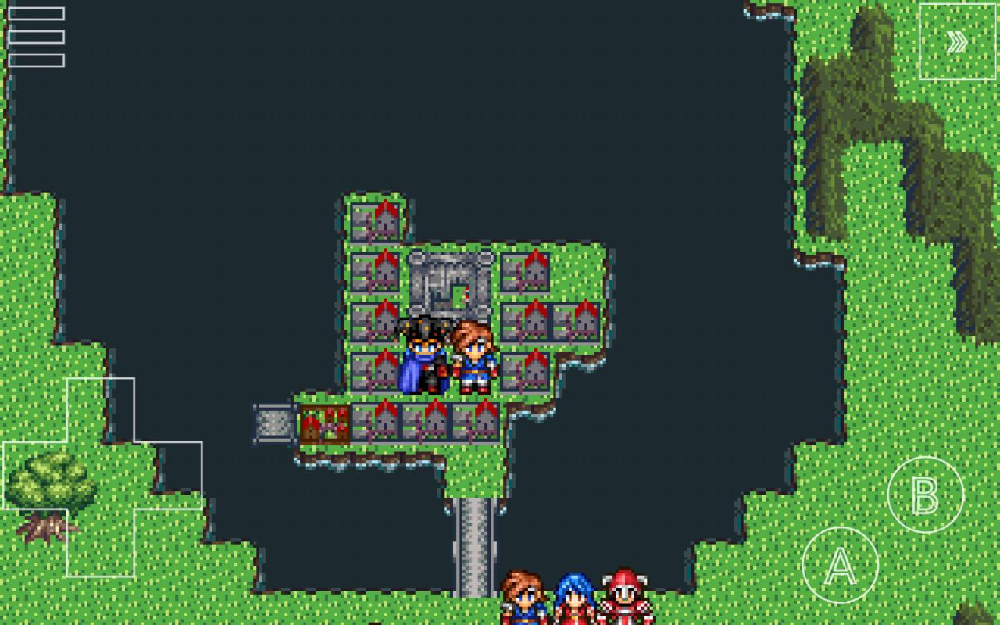

# RPG Maker 2000/2003 (EasyRPG)

### Description

 EasyRPG is a role playing game engine compatible with RPG Maker 2000 and 2003.

### License

GPLv3

### Icon

### Fanart

Help make me fanart!

### Screenshots

